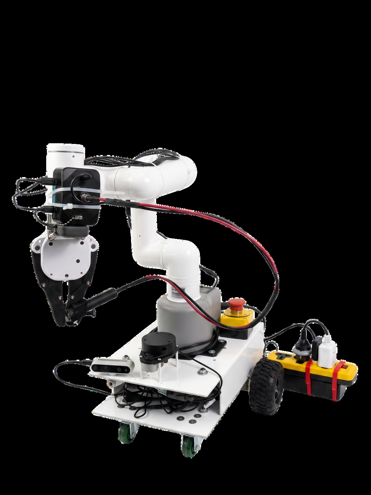

<div align="center">



# ANUBIX

### Autonomous Robot for Early-Stage Agricultural Disease Detection

**Detecting crop diseases *before* visual symptoms appear — using spectroscopy, AI, and robotics.**

*Graduation Project — Benha University, Shoubra Faculty of Engineering*
*Communications & Computer Engineering Program (CCEP)*
*June 2026*

[](https://docs.ros.org/en/humble/)
[](https://developer.nvidia.com/embedded/jetson-orin-nano)
[](https://omnilink.ai)
[]()

---

</div>

## What is ANUBIX?

Plant diseases spread silently. By the time a farmer sees yellowing leaves or wilting stems, the virus has already spread to neighboring plants — and the economic damage is done.

**ANUBIX changes that.** It's an autonomous mobile robot that can detect crop diseases *before any visible symptoms appear*. Instead of relying on cameras to spot what the human eye can already see, ANUBIX uses **near-infrared (NIR) spectroscopy** to look *inside* the plant tissue and catch the invisible biochemical markers of infection.

A farmer simply types a command — in Arabic or English — like *"Scan the tomatoes in Aisle 3"*, and ANUBIX handles everything autonomously: navigating to the target, identifying leaves through dense foliage, gently grasping them with a robotic arm, and performing a spectral scan that reveals whether the plant is healthy or carrying a hidden infection.

<div align="center">


*The team collecting spectral readings from tomato plant samples using the SI-NIR spectrometer*
</div>

---

## Why It Matters

Current agricultural monitoring falls short in three critical ways:

| Existing Approach | The Problem |
|---|---|
| **Drones & RGB Cameras** | Too late — they only detect *visible* symptoms after the virus has already spread |
| **Handheld Spectrometers** | Lab-grade accuracy, but manually sampling thousands of plants is economically unviable |
| **Fixed Sensor Arrays** | Require installing thousands of units — exorbitant cost makes facility-wide coverage impossible |

**ANUBIX combines the best of all three**: the mobility of a drone, the lab-grade biochemical analysis of a spectrometer, and the autonomy of a fixed system — all in one intelligent robot that a farmer can command in plain language.

---

## How It Works

Every inspection mission follows an autonomous sequence — orchestrated by an AI agent that breaks down the farmer's natural language command into structured robotic actions:

```
  Farmer types: "Scan the lower leaves in Aisle 3 for mosaic virus"
                                    |
                    ┌───────────────┼───────────────┐
                    v               v               v
              1. NAVIGATE      2. PERCEIVE     3. MANIPULATE
              Drive to the     Use AI vision   Extend the 6-DOF
              target aisle     to find and     arm, gently grasp
              autonomously     locate leaves   the target leaf
                    |               |               |
                    └───────────────┼───────────────┘
                                    v
                            4. SCAN & DIAGNOSE
                            Place the NIR spectrometer
                            against the leaf tissue
                                    |
                                    v
                         5. REPORT RESULTS
                         Upload diagnosis + photo
                         to the cloud dashboard
```

The AI agent handles failure recovery automatically — if the gripper slips, it retries. If a path is blocked, it replans. If perception fails at close range, it continues anyway because *the spectrometer is the real diagnostic tool, not the camera*.

<div align="center">


*Field testing: the SI-NIR spectrometer scanning plant samples with real-time data acquisition*
</div>

---

## System Architecture

ANUBIX is built as a distributed ROS 2 system spanning two computers — an **NVIDIA Jetson Orin Nano** (AI inference + perception) and a **Raspberry Pi** (navigation + motor control) — connected over CycloneDDS.

<div align="center">


*High-level system architecture showing the seven interconnected stacks*
</div>

### The Seven Stacks

| Stack | What It Does |
|---|---|
| **Master (Brain)** | Bridges the cloud AI agent to every hardware subsystem. Receives tool calls from OmniLink/Gemini, dispatches them as ROS 2 commands, and returns structured feedback. |
| **Navigation** | Fuses 2D LIDAR, wheel odometry, and IMU data via SLAM. Plans collision-free routes through greenhouse aisles using Nav2. |
| **Perception** | Runs YOLOv8 instance segmentation on the Jetson GPU to locate leaves in dense foliage. Dual cameras provide 3D coordinates for the arm. |
| **Arm Control** | Controls the MyCobot Pro 450 (6-DOF) with custom DH kinematics. Threads the arm through foliage to place the spectrometer precisely on the leaf. |
| **Gripper** | Manages the myGripperF100 end-effector. Position-monitoring detects when a leaf is successfully grasped. |
| **Spectrometer** | Drives the SI-NIR sensor via TCP, captures spectral reflectance data, and sends it to a cloud-hosted SVM model that classifies the plant's health status. |
| **Cloud** | Uploads scan results, diagnosis, and photos to Supabase for the web dashboard. |

---

## Technology Deep Dive

### The AI Brain — LLM Task Planning

ANUBIX doesn't run a fixed script. A cloud-hosted **Google Gemini** model (via OmniLink Agents) acts as the robot's cognitive engine. It receives natural language commands, decomposes them into a strict 12-step execution sequence, and dispatches structured tool calls to the robot's hardware.

Key innovations:
- **Phase Discriminators** — prevent the LLM from collapsing repeated tool calls with identical arguments
- **Nudge Mechanism** — automatically recovers when the model emits narration without a tool call
- **Emergency Bypass** — detects keywords like "stop" or "abort" and bypasses the command queue for immediate halt
- **Custom API Client** — built to bypass OmniLink's broken API callback, with SSH tunneling over Tailscale VPN

### Perception — Seeing Through the Canopy

The vision system uses a **dual-camera strategy**:

1. **Intel RealSense D435i** (wide-angle, depth) — initial scan to locate leaves and compute 3D coordinates via stereo depth
2. **USB Flange Camera** (mounted on the arm) — precision close-range targeting using parallax-based depth estimation

A **YOLOv8m-seg** model (TensorRT FP16 optimized) runs real-time instance segmentation, detecting four classes: healthy leaves, unhealthy leaves, green tomatoes, and ripened tomatoes. The model was trained on 2,500+ images including a custom hand-annotated dataset.

> **Important**: YOLO is used for *leaf localization*, not disease detection. The camera finds the leaf — the spectrometer diagnoses it.

### Spectroscopy — Looking Inside the Plant

This is the core innovation. The **SI-NIR spectrometer** (by Si-Ware Systems) captures near-infrared reflectance across 1400-2500 nm wavelengths. At this range, the light penetrates plant tissue and reveals biochemical markers — changes in chlorophyll, water content, and cellular structure — that indicate viral infection *days or weeks before any visible symptoms*.

The spectral data is processed through:
1. **Savitzky-Golay filtering** and advanced preprocessing
2. **PCA dimensionality reduction** 
3. **SVM classification** — trained on 3,200+ spectral readings collected by the team

The model classifies plants as Healthy, Early-Stage Infection, or Diseased — giving farmers an early warning system to isolate and treat before outbreaks spread.

<div align="center">


*The SI-NIR spectrometer connected to the Jetson for field data collection*
</div>

### Arm Control — Precision in Dense Foliage

The **MyCobot Pro 450 Elite** (6-DOF, harmonic drive) is controlled through custom forward/inverse kinematics using Denavit-Hartenberg parameters. The arm navigates through dense plant canopies with:

- Capsule-based self-collision checking
- Real-time Z-axis floor monitoring
- Layered safety architecture (software limits, collision detection, emergency stop)
- Multi-phase trajectory planning (standoff, approach, grasp, retract)

---

## Repository Structure

This workspace contains **9 ROS 2 packages**:

```
anubix_ws/
├── src/
│   ├── anubix_master/          # Central brain — AI agent <-> ROS 2 bridge
│   ├── anubix_navigation/      # SLAM, path planning, waypoint navigation
│   ├── anubix_vision/          # YOLOv8 perception, dual-camera pipeline
│   ├── anubix_arm/             # MyCobot Pro 450 kinematics & control
│   ├── anubix_gripper/         # myGripperF100 end-effector control
│   ├── anubix_spectrometer/    # SI-NIR driver, spectral data + ML inference
│   ├── anubix_supabase/        # Cloud upload (results, photos, diagnosis)
│   ├── anubix_jetson_bridge/   # Cross-device link monitor (Jetson <-> RPi)
│   └── anubix_bringup/         # Launch files for full system startup
├── agent_config/               # AI agent prompt & tool definitions
└── docs/assets/                # Project images
```

---

## Getting Started

### Prerequisites

- **Hardware**: NVIDIA Jetson Orin Nano (8GB), Raspberry Pi 4, MyCobot Pro 450, SI-NIR Spectrometer, Intel RealSense D435i
- **Software**: Ubuntu 22.04, ROS 2 Humble, Python 3.10+

### Build

```bash
cd anubix_ws
colcon build --symlink-install
source install/setup.bash
```

### Launch

```bash
# Full system launch on the Jetson
ros2 launch anubix_bringup jetson.launch.py
```

---

## The Team

<div align="center">


*The ANUBIX squad during one of many late-night sessions*
</div>

<br>

<div align="center">

| | | |
|:---:|:---:|:---:|
| **Abdelrahman Atef** | **Andrew Ayman** | **Ahmed Abdelwahed** |
| **Hanin Sherif** | **Hazem Abuelanin** | **Mohamed Hany** |

</div>

**Supervised by:** Prof. Lamiaa Elrefaei & Dr. Mai Ahmed Mohamed

---

## The Journey

Building ANUBIX was more than a graduation project — it was a year of growing tomatoes in our apartments, transporting plants across Cairo, debugging boot failures with soldered STM32 probes, and collecting thousands of spectral readings one leaf at a time.

<div align="center">

<table>
<tr>
<td align="center"><br><em>The day the arm first moved</em></td>
<td align="center"><br><em>Transporting ANUBIX for testing</em></td>
</tr>
<tr>
<td align="center"><br><em>Building the mobile base from scratch</em></td>
<td align="center"><br><em>Our tomato plants — grown for data collection</em></td>
</tr>
</table>

</div>

---

## Acknowledgments

This project would not have been possible without:

- **[Si-Ware Systems](https://www.si-ware.com/)** — Co-owner of the project alongside our university. Provided the SI-NIR spectrometer, technical mentorship, and lab access. Special thanks to Dr. Yasser Sabry, Eng. Moez El Massry, and Eng. Shady Reda.

- **[OmniLink Agents](https://omnilink.ai)** — Provided the AI agent infrastructure and cloud inference services that power ANUBIX's cognitive engine. Thanks to Eng. Ahmed Fetouh.

- **Department of Plant Diseases, Faculty of Agriculture, Ain Shams University** — Dr. Medhat Kamel provided essential agricultural mentorship and the plant samples needed for data collection and field testing.

- **Prof. Dr. Lamiaa Elrefaei** — Our project supervisor, whose guidance shaped every aspect of ANUBIX from architecture to execution.

---

<div align="center">

*Built with determination, tomato plants, and way too much coffee.*

**Benha University — Shoubra Faculty of Engineering — CCEP Department — Class of 2026**

</div>
