<div align="center">

# ANUBIX
### Autonomous Robot for Early-Stage Agricultural Disease Detection

**Detecting crop diseases *before* visual symptoms appear — using spectroscopy, AI, and robotics.**

*Graduation Project — in collaboration with SI-Ware Systems,*
*Benha University, Shoubra Faculty of Engineering*
*Communications & Computer Engineering Program (CCEP),*
*June 2026*

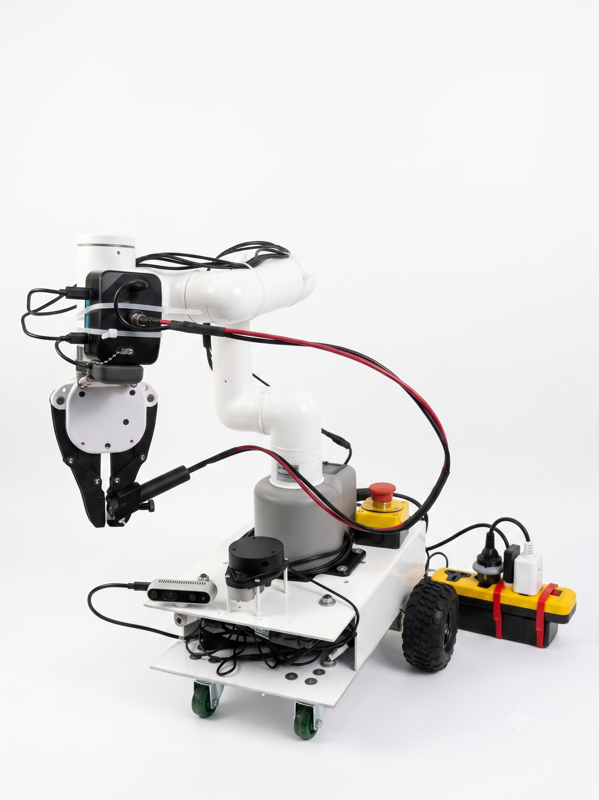

[](https://docs.ros.org/en/humble/)
[](https://developer.nvidia.com/embedded/jetson-orin-nano)
[](https://omnilink.ai)
[](https://python.org)
[]()

---

</div>

## What is ANUBIX?

Plant diseases spread silently. By the time a farmer sees yellowing leaves or wilting stems, the virus has already spread to neighboring plants — and the economic damage is done.

**ANUBIX changes that.** It's an autonomous mobile robot that can detect crop diseases *before any visible symptoms appear*. Instead of relying on cameras to spot what the human eye can already see, ANUBIX uses **near-infrared (NIR) spectroscopy** to look *inside* the plant tissue and catch the invisible biochemical markers of infection.

A farmer simply types a command on his dashboard — in Arabic or English — like *"Scan the tomatoes in Aisle 3"*, and ANUBIX handles everything autonomously: navigating to the target, identifying leaves through dense foliage, gently grasping them with a robotic arm, and performing a spectral scan that reveals whether the plant is healthy or carrying a hidden infection.

<div align="center">
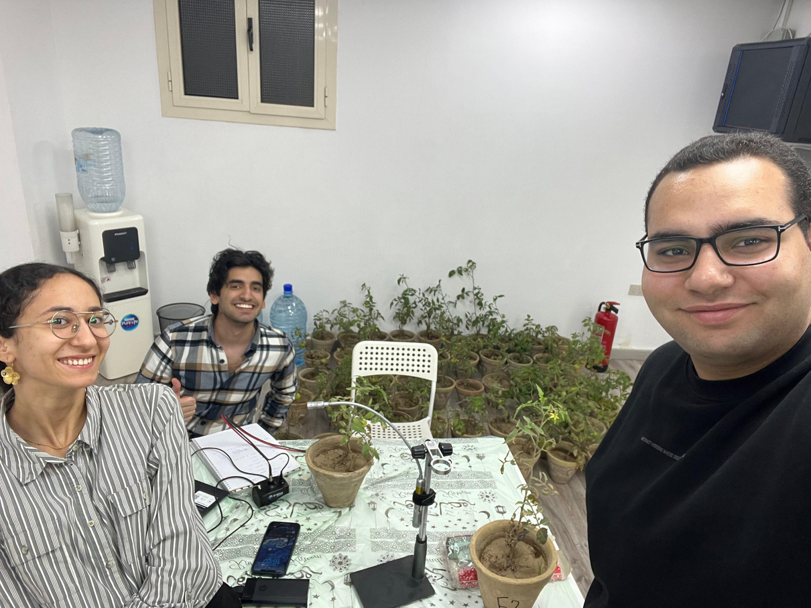

*The team collecting spectral readings from tomato plant samples using the SI-NIR spectrometer*
</div>

---

## Why It Matters

Current agricultural monitoring falls short in three critical ways:

| Existing Approach | The Problem |
|---|---|
| **Drones & RGB Cameras** | Too late — they only detect *visible* symptoms after the virus has already spread |
| **Handheld Spectrometers** | Lab-grade accuracy, but manually sampling thousands of plants is economically unviable |
| **Fixed Sensor Arrays** | Require installing thousands of units — exorbitant cost makes facility-wide coverage impossible |

**ANUBIX combines the best of all three**: the mobility of a drone, the lab-grade biochemical analysis of a spectrometer, and the autonomy of a fixed system — all in one intelligent robot that a farmer can command in plain language.

---

## Demos

### Full System Demo

<div align="center">
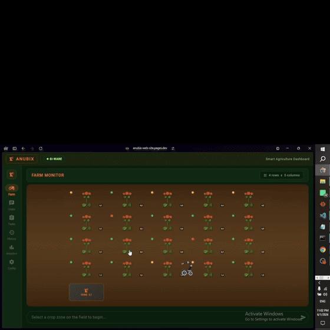

*End-to-end autonomous mission: the robot navigates to a target zone, locates a leaf through computer vision, extends the robotic arm, grasps the leaf, and performs a spectral scan — all from a single natural language command.*
</div>

### RealSense D435i — Wide-Angle Leaf Detection

<div align="center">
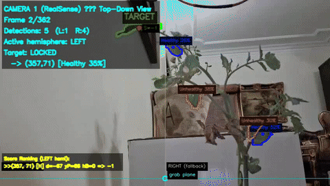

*YOLOv8m-seg instance segmentation running on the Jetson GPU via TensorRT FP16. The model detects and segments healthy leaves, unhealthy leaves, green tomatoes, and ripened tomatoes in real time. Depth data from the RealSense stereo pair is aligned and back-projected to produce 3D coordinates for the arm.*
</div>

### USB Flange Camera — Precision Close-Range Targeting

<div align="center">
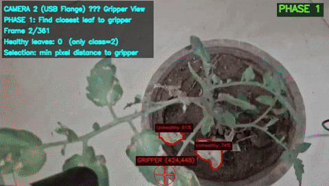

*The end-effector-mounted monocular camera performs a 1 cm calibration displacement to derive depth via parallax. After the RealSense provides a coarse position, the flange camera re-detects the target leaf at close range, computes a 3D correction vector (dx, dy, depth), and guides the arm to its final grip position.*
</div>

---

## The Team

<div align="center">
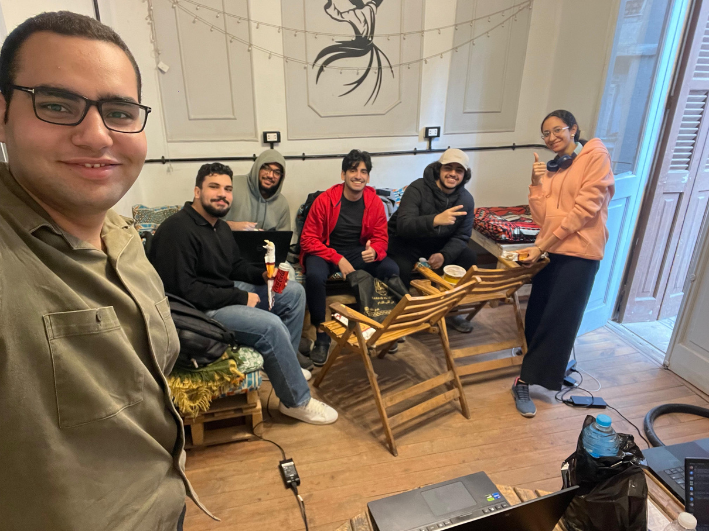

*The ANUBIX squad during one of many late-night sessions*
</div>

<br>

<table>
<tr>
<td align="center" width="33%"><br><b>Abdelrahman Atef</b><br><em>Team Leader, System Architect, AI Agent & Cloud Deployment</em></td>
<td align="center" width="33%"><br><b>Andrew Ayman</b><br><em>NIR Spectroscopy, ML & Sensor Integration</em></td>
<td align="center" width="33%">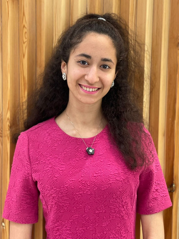<br><b>Hanin Sherif</b><br><em>Perception, CV & Edge Deployment</em></td>
</tr>
<tr>
<td align="center" width="33%">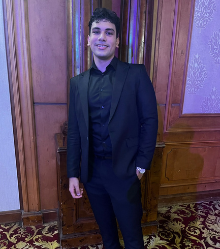<br><b>Mohamed Hany</b><br><em>Navigation & SLAM</em></td>
<td align="center" width="33%"><br><b>Hazem Abuelanin</b><br><em>Autonomous Navigation & Motion Control</em></td>
<td align="center" width="33%"><br><b>Ahmed Abdelwahed</b><br><em>Arm Control</em></td>
</tr>
</table>

**Supervised by:** Prof. Lamiaa Elrefaei

---

## How It Works

Every inspection mission follows an autonomous 12-step sequence — orchestrated by an AI agent that breaks down the farmer's natural language command into structured tool calls:

<div align="center">
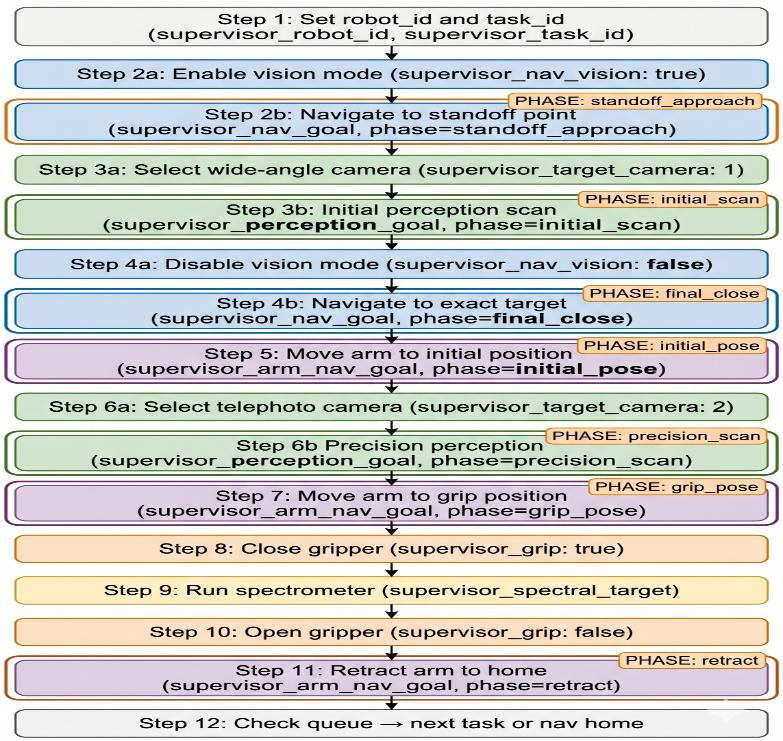

*The complete 12-step execution sequence. Color-coded phase discriminators (standoff_approach, final_close, initial_scan, precision_scan, initial_pose, grip_pose, retract) make each tool call structurally unique, preventing the LLM from collapsing repeated calls.*
</div>

The AI agent handles failure recovery automatically with predefined protocols:

| Error | Response |
|---|---|
| Navigation blocked | Retry once, then skip task |
| Navigation failure | Immediate abort (`force_stop`) |
| Perception `not_found` (initial scan) | Skip task, retract arm |
| Perception `not_found` (precision scan) | Continue — the spectrometer is the real diagnostic |
| Arm blockage | Retry once |
| Arm mechanical error | Immediate abort |
| Gripper slip | 3-strike protocol: retry, re-perceive & re-grip, give up |
| Spectrometer failure | Safe release, retract, advance queue |

---

## System Architecture

ANUBIX is built as a distributed ROS 2 system spanning two computers — an **NVIDIA Jetson Orin Nano** (AI inference + perception + arm + gripper + spectrometer) and a **Raspberry Pi 4** (navigation + motor control) — connected over **CycloneDDS** with a dedicated bridge node monitoring link health.

<div align="center">
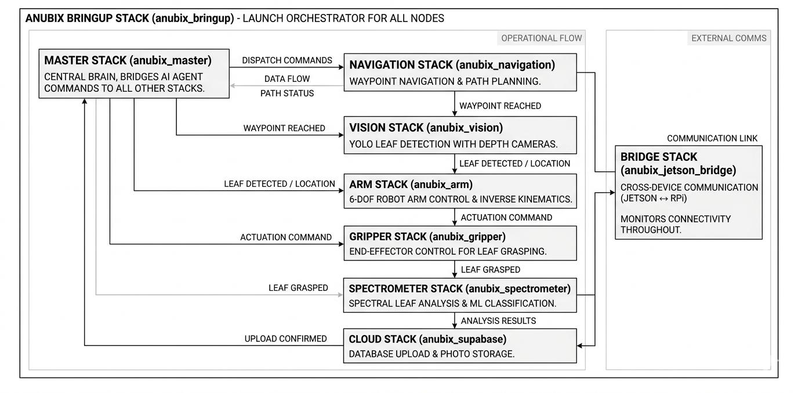

*High-level system architecture showing the seven interconnected stacks and their data flow*
</div>

### The Seven Stacks

| Stack | Package | What It Does |
|---|---|---|
| **Master (Brain)** | `anubix_master` | Bridges the cloud AI agent to every hardware subsystem. Runs an HTTP server that receives tool calls from OmniLink/Gemini, dispatches them as ROS 2 messages via 11 publishers, and collects feedback from 8 subscribers using synchronous `threading.Event` waits with 120s timeouts. |
| **Navigation** | `anubix_navigation` | Fuses 2D LIDAR (RPLiDAR A1), wheel odometry (ESP32 quadrature encoders), and IMU data via EKF. Runs SLAM Toolbox for mapping and AMCL for localization. Plans collision-free routes using Nav2 with DWA local planner. |
| **Perception** | `anubix_vision` | Runs YOLOv8m-seg instance segmentation on the Jetson's 1024 CUDA cores via TensorRT FP16. Dual-camera pipeline: RealSense D435i for 3D back-projection, USB flange camera for parallax-based close-range targeting. |
| **Arm Control** | `anubix_arm` | Controls the MyCobot Pro 450 Elite (6-DOF, harmonic drive) with custom DH forward/inverse kinematics. Capsule self-collision checking, Z-axis floor monitor, multi-phase trajectory planning. |
| **Gripper** | `anubix_gripper` | Manages the myGripperF100 via pymycobot. Position-monitoring leaf detection — tracks gripper position changes to confirm successful grasp. Configurable torque limits (tested holding a brittle egg at 8/300). |
| **Spectrometer** | `anubix_spectrometer` | Drives the SI-NIR sensor via dual TCP sockets (command + data). Captures spectral reflectance (1400-2500 nm), performs edge preprocessing (dequantization, spectral averaging, background normalization), and sends processed spectra to a cloud-hosted SVM classifier via REST API. |
| **Cloud** | `anubix_supabase` | Uploads scan results, diagnosis labels, and photos to Supabase (PostgreSQL + Storage). Powers the Flutter web dashboard. |
| **Bridge** | `anubix_jetson_bridge` | Monitors CycloneDDS cross-device link (Jetson <-> RPi). Publishes heartbeat, detects disconnection, triggers reconnection. |
| **Bringup** | `anubix_bringup` | Launch files for full system startup. Orchestrates node initialization order and parameter loading. |

---

## Technology Deep Dive

### 1. The AI Brain — LLM Task Planning

ANUBIX doesn't run a fixed script. A cloud-hosted **Google Gemini** model (via the OmniLink Agents platform) acts as the robot's cognitive engine.

<div align="center">
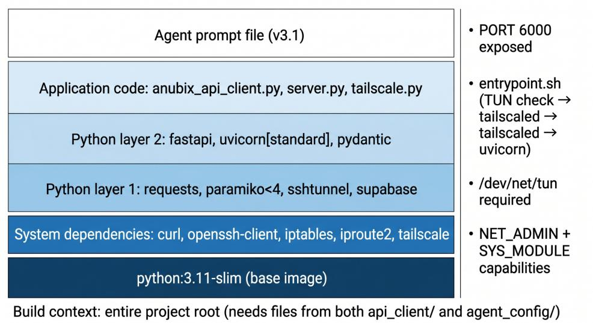

*The Docker-based deployment architecture: python:3.11-slim base image on AWS EC2, with FastAPI, Tailscale VPN, and SSH tunneling to the Jetson.*
</div>

**The LLM Brain evolved through three phases**, each driven by specific technical problems:

| Phase | Stack | Limitation |
|---|---|---|
| **Phase 1** | LangChain/LangGraph + Qwen 3 8B (local via Ollama) | Unreliable tool calling, local-only inference |
| **Phase 2** | OmniLink Agents + Gemini (cloud) | API tool callbacks didn't work — critical blocker |
| **Phase 3** | Custom API Client + OmniLink inference | Full production system with self-managed tool dispatch |

**Key innovations in the final architecture:**

- **Phase Discriminators** — The LLM engine collapsed repeated tool calls with identical arguments into a single call. Steps 2 and 4 both call `nav_goal` with the same coordinates. Solution: added a `phase` parameter as a structural discriminator (`standoff_approach` vs `final_close`, `initial_scan` vs `precision_scan`), making each call structurally unique.

- **Nudge Mechanism** — Gemini sometimes emits narration without a tool call, stalling the mission. A detector catches text-only responses and re-prompts: *"Your last response included narration but no tool call. Re-read the last tool result, identify the current step, emit the corresponding tool call."* Capped at 5 consecutive nudges.

- **Custom API Client** (`OmniChatRunner`) — Self-managed tool dispatch loop: posts to OmniLink `/api/chat`, receives tool calls, dispatches them to the Jetson via `JetsonToolClient` (HTTP over SSH tunnel via Tailscale VPN with 3-attempt exponential backoff), appends results, repeats. 60-round safety cap, session-unique agent names to prevent server-side memory doubling.

- **FastAPI Service** — Wraps the client as a REST API for the Flutter app. FIFO queue (`asyncio.Lock`) ensures one mission at a time. Session affinity registry for multi-turn conversation continuity. Fire-and-forget `/run` endpoint with async background execution.

- **Emergency Bypass** — Detects keywords ("stop", "halt", "abort", "e-stop") and bypasses the FIFO queue entirely, dispatching `force_stop` directly to the Jetson. Signals the runner's abort `threading.Event` to exit cleanly between tool dispatches.

**ROS 2 Master Node — The Bridge:**

The master node (`ros_master_node.py`) is the single point of contact between the AI agent and the robot's hardware. It implements the **synchronous execution pattern**: each tool call publishes a command on the appropriate ROS 2 topic, then blocks on `Event.wait(timeout=120)` until the hardware subscriber callback receives a terminal status and calls `Event.set()`.

| Direction | Topics | QoS |
|---|---|---|
| **Commands Out** (11 publishers) | `robot_id`, `task_id`, `nav_vision`, `nav_goal`, `target_camera`, `perception_goal`, `arm_nav_goal`, `grip`, `spectral_target`, `force_stop`, `supabase_upload` | TRANSIENT_LOCAL for config, VOLATILE for edge-triggered signals |
| **Feedback In** (8 subscribers) | `nav_status`, `perception_status`, `perception_target_pose`, `arm_status`, `arm_current_pose`, `gripper_status`, `spectrometer_status`, `supabase_status` | Matched to publishers |

---

### 2. Perception — Seeing Through the Canopy

<div align="center">
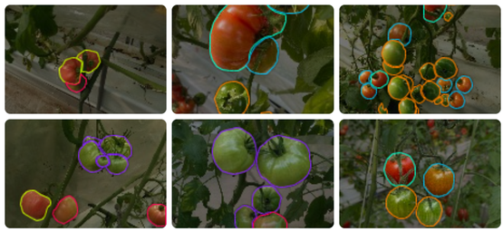

*YOLOv8m-seg instance segmentation on real greenhouse imagery. The model detects and segments four classes — healthy leaves, unhealthy leaves, green tomatoes, and ripened tomatoes — across varied lighting and occlusion conditions.*
</div>

The vision system uses a **dual-camera strategy** with a single YOLOv8m-seg model shared across both pipelines:

#### Camera 1: Intel RealSense D435i (Wide-Angle + Depth)

- **Stream**: 640x480 @ 30 FPS, 16-bit depth + BGR8 color
- **Alignment**: `rs.align` reprojects depth onto color plane, eliminating spatial mismatch between sensors
- **Inference**: TensorRT-optimized YOLOv8m-seg runs in a persistent CUDA context within a dedicated thread
- **Depth estimation**: Samples aligned depth at leaf centroid, filters zero-depth (caused by specular reflections), back-projects via `rs2_deproject_pixel_to_point` with factory intrinsics to get 3D coordinates (X, Y, Z) in meters
- **Leaf selection algorithm**: Composite scoring — left-side preference (arm approach axis) + vertical band penalties (middle: 0, top: +200, bottom: +500) + task-driven priority (-300 for unhealthy leaves)

#### Camera 2: USB Flange Camera (Close-Range Parallax)

- **Activation**: After the arm reaches a coarse pre-grasp position from Camera 1 output
- **Phase 1**: YOLOv8 detects the target leaf closest to the gripper reference pixel, records `centroid_1`
- **Calibration move**: Commands a precise 1 cm absolute X-axis displacement, waits for arm confirmation, flushes camera buffer
- **Phase 2**: Re-detects the target within a strict tracking radius, records `centroid_2`
- **Depth via parallax**: Calculates depth from the vertical pixel shift caused by the known 1 cm lateral movement. Publishes the 3D correction vector (dx, dy, depth) to guide the arm's final alignment.

<div align="center">
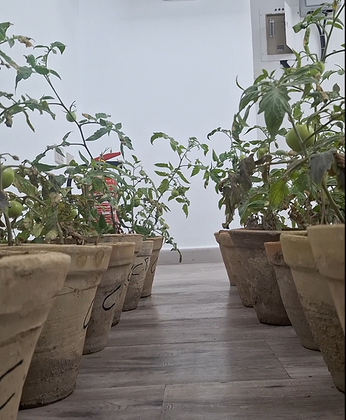

*The leaf selection algorithm with left-side preference, vertical band scoring, and task-driven priority for unhealthy targets*
</div>

#### AI Model

| Parameter | Value |
|---|---|
| Base model | `yolov8m-seg.pt` (pretrained on COCO) |
| Classes | 4: `green_tomato`, `ripened_tomato`, `healthy_leaf`, `unhealthy_leaf` |
| Training | 100 epochs, 640x640, NVIDIA GPU |
| Dataset | 2,492 images (1,992 Roboflow + 500 custom hand-annotated) |
| Export | TensorRT FP16 for Jetson Orin Nano |
| Precision | 0.752 (all), 0.858 (green), 0.892 (ripened), 0.628 (healthy leaf), 0.628 (unhealthy leaf) |

> **Important**: YOLOv8 is used for *leaf localization and segmentation*, not disease detection. The camera finds the leaf — the spectrometer diagnoses it.

<div align="center">
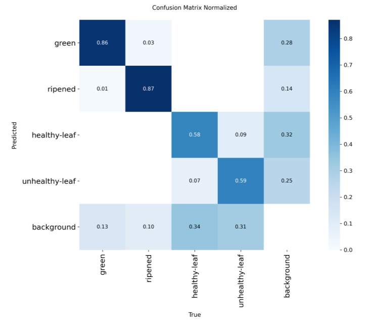

*YOLOv8m-seg training metrics across 100 epochs*
</div>

---

### 3. Spectroscopy — Looking Inside the Plant

This is the core innovation. While cameras can only see surface-level symptoms, the **SI-NIR spectrometer** (by Si-Ware Systems) captures near-infrared reflectance across **1400-2500 nm** wavelengths. At this range, light penetrates plant tissue and reveals biochemical markers — changes in chlorophyll, water content, and cellular structure — that indicate viral infection *days or weeks before any visible symptoms*.

<div align="center">
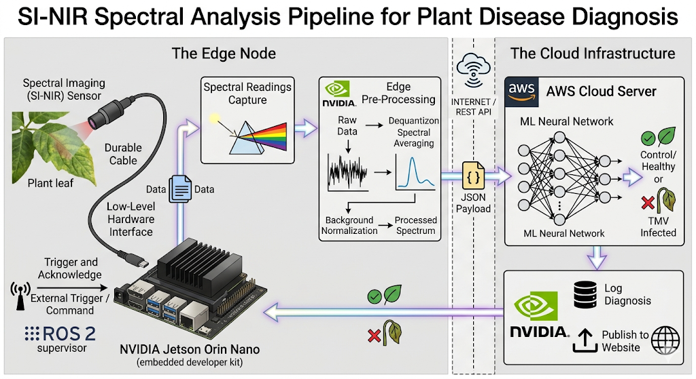

*The complete spectral analysis pipeline: from SI-NIR sensor on the plant leaf, through edge preprocessing on the Jetson, to cloud ML inference on AWS, and back to the web dashboard.*
</div>

#### Implementation Pipeline

1. **Hardware Interface**: SI-NIR sensor connects to the Jetson via TCP/IP. Dual-socket architecture — command socket for trigger/acknowledge, data socket for spectral readout.
2. **Data Acquisition**: Raw interferograms captured at configurable scan times (e.g., 2000 ms), converted to Power Spectral Density (PSD) arrays.
3. **Edge Preprocessing**: Dequantization, spectral averaging across multiple scans, background normalization (dividing by reference spectrum).
4. **Cloud Transmission**: Processed spectrum sent as JSON payload to AWS-hosted REST API.
5. **ML Classification**: Cloud model returns health status (Healthy / Early-Stage Infection / Diseased).

#### Machine Learning Pipeline

<div align="center">
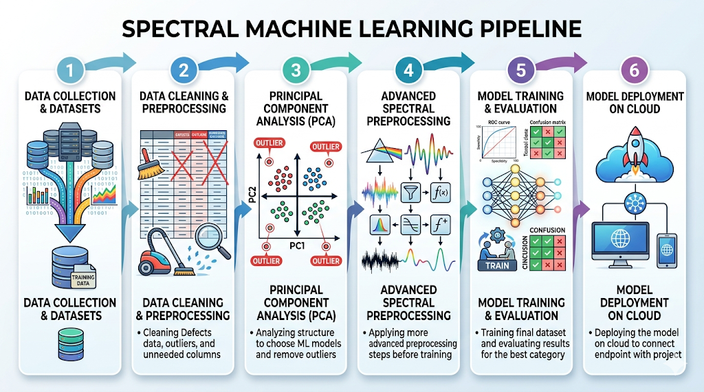

*The 6-stage spectral machine learning pipeline: from raw data collection through PCA analysis to cloud-deployed SVM classification.*
</div>

The ML pipeline was trained on **3,200+ spectral readings** collected by the team from real tomato plants:

| Stage | Details |
|---|---|
| **Data Collection** | 3,200+ readings from Control, Virus-infected, and Selenium-treated plants |
| **Data Cleaning** | Removed defective readings, outliers, and irrelevant columns |
| **PCA** | Principal Component Analysis to visualize class separability and remove outliers |
| **Preprocessing** | Savitzky-Golay filtering, Standard Normal Variate (SNV), multiplicative scatter correction |
| **Model Training** | SVM with RBF kernel (primary), ResNet (experimental), Siamese Networks (metric learning) |
| **Deployment** | Best model deployed on AWS cloud with REST API endpoint |

<div align="center">
<table>
<tr>
<td align="center">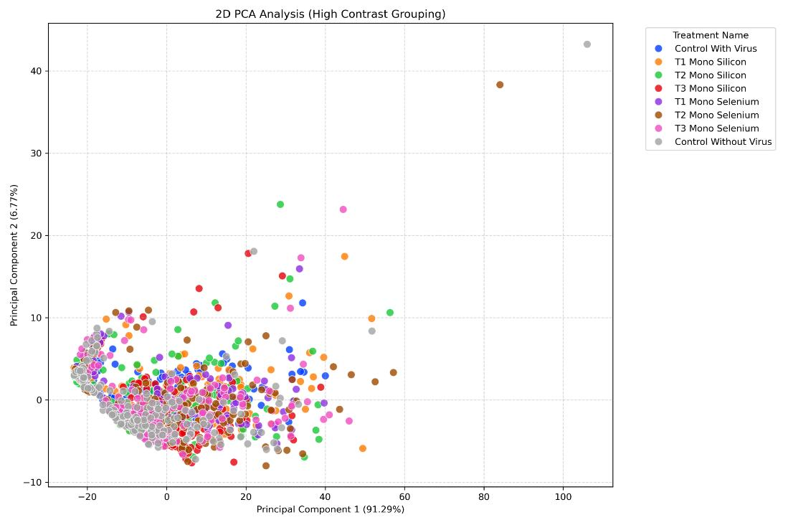<br><em>PCA visualization: Virus-infected vs Healthy samples showing clear class separation</em></td>
<td align="center">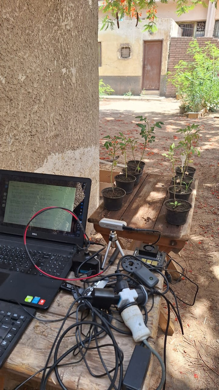<br><em>Field testing: SI-NIR spectrometer scanning plant samples</em></td>
</tr>
</table>
</div>

---

### 4. Navigation — Autonomous Greenhouse Traversal

The navigation stack runs on the **Raspberry Pi 4** and solves the SLAM problem in visually repetitive greenhouse environments.

<div align="center">
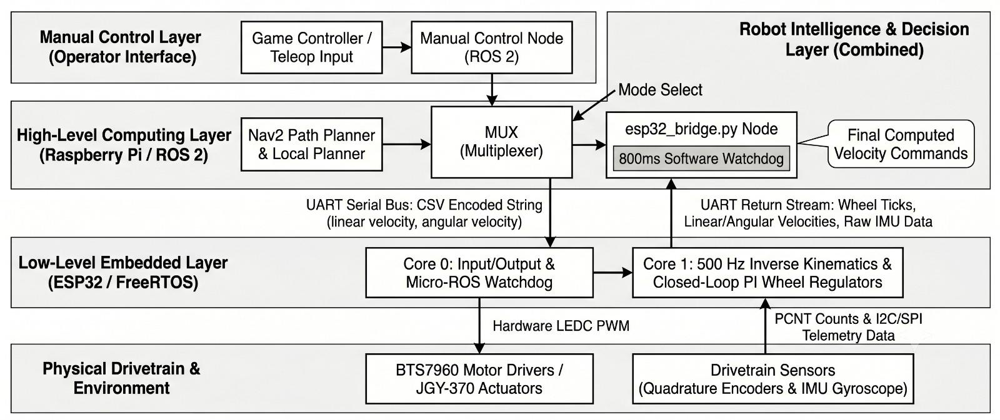

*Four-layer navigation architecture: Manual Control, High-Level Computing (Raspberry Pi / ROS 2 / Nav2), Low-Level Embedded (ESP32 / FreeRTOS with 500 Hz PI wheel regulators), and Physical Drivetrain (BTS7960 drivers + JGY-370 motors).*
</div>

#### SLAM & Localization

- **SLAM Toolbox** (Karto-based): Correlation-based scan matching, incremental pose graph construction, loop closure detection, Ceres nonlinear optimization
- **Sensor Fusion**: RPLiDAR A1 (`sensor_msgs/LaserScan`) + ESP32 wheel encoders + IMU, fused via EKF (`robot_localization`)
- **AMCL**: Adaptive Monte Carlo Localization with particle filter for runtime pose estimation
- **Output**: Occupancy grid map (`.pgm` + `.yaml`) and optimized pose graph

<div align="center">
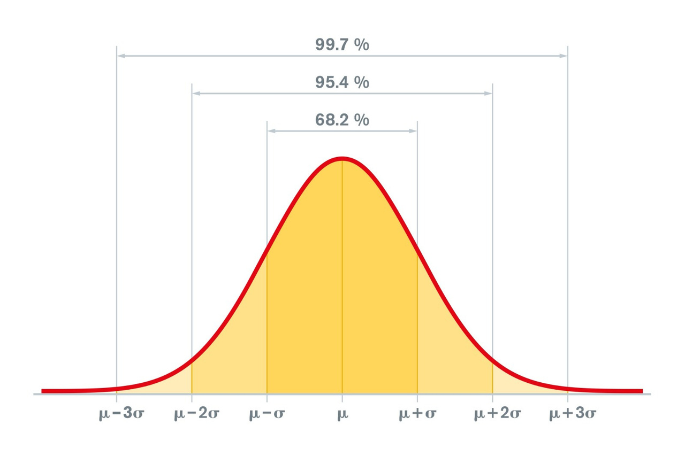

*SLAM-generated occupancy grid map of the test environment*
</div>

#### Autonomous Navigation (Nav2)

- **Global Planner**: A* search on the occupancy grid for optimal path
- **Local Planner**: Dynamic Window Approach (DWA) for obstacle avoidance and velocity command generation
- **Costmaps**: Static layer (from SLAM map) + obstacle layer (live LIDAR) + inflation layer (safety margin)
- **Vision-aware standoff**: When `nav_vision=true`, the robot stops 1 meter short of the target to allow the camera to scan the area before final approach

#### Low-Level Motion Control

The ESP32 microcontroller runs **FreeRTOS** with dual-core architecture:
- **Core 0**: UART I/O with Raspberry Pi + Micro-ROS watchdog (800 ms timeout)
- **Core 1**: 500 Hz inverse kinematics + closed-loop PI wheel regulators with quadrature encoder feedback
- **Motor drivers**: BTS7960 H-bridges driving JGY-370 gear motors via hardware LEDC PWM

---

### 5. Arm Control — Precision in Dense Foliage

The **MyCobot Pro 450 Elite** (6-DOF, harmonic drive, 450mm reach) is controlled through custom kinematics — not MoveIt.

#### Kinematics

- **Forward Kinematics**: Full DH parameter table implementation. Computes end-effector pose from joint angles using homogeneous transformation matrices.
- **Inverse Kinematics**: Geometric closed-form solution for the Pro 450's specific joint configuration. No iterative solvers — deterministic and fast.

#### Safety Architecture (Layered Defence in Depth)

| Layer | Mechanism |
|---|---|
| **Software Joint Limits** | Per-joint angle bounds checked before every move command |
| **Capsule Self-Collision** | Models each link as a capsule; checks pairwise distances before execution |
| **Z-Axis Floor Monitor** | Real-time thread monitors end-effector Z height, aborts if approaching floor |
| **Velocity Limits** | Speed capped during approach phases |
| **Emergency Stop** | `force_stop` pulse (True -> 200ms -> False) immediately halts all motion |

#### Trajectory Planning

Multi-phase trajectories with phase discriminators:
1. `initial_pose` — Move to pre-approach position above the target
2. `grip_pose` — Descend to the leaf grasping position
3. `retract` — Post-release retract guard prevents collision after object release

<div align="center">
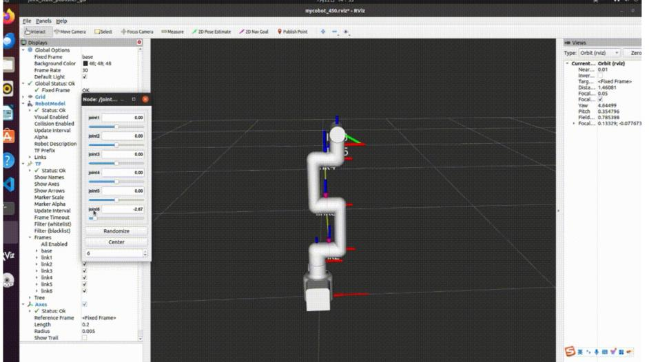

*RViz simulation confirming correct joint articulation and validating the Pro 450 kinematic model*
</div>

---

### 6. Hardware Platform

<div align="center">
<table>
<tr>
<td align="center">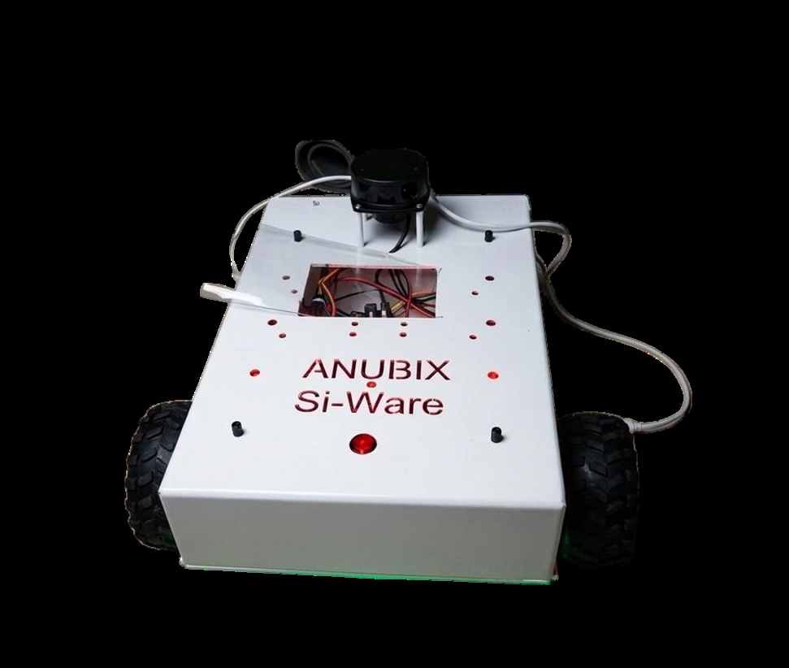<br><em>The custom mobile base</em></td>
<td align="center">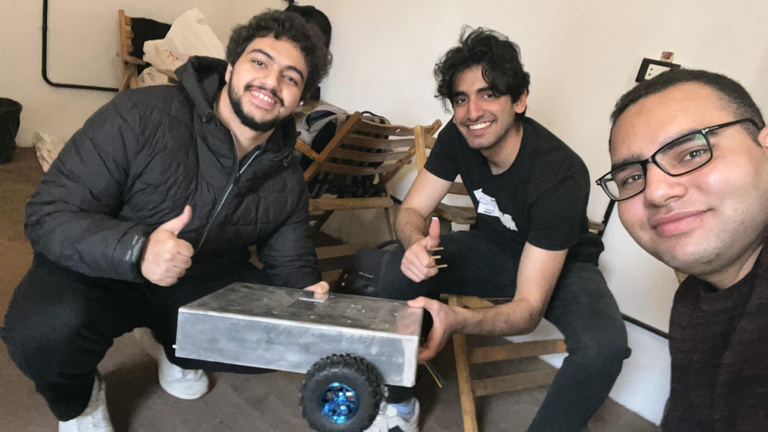<br><em>Early built ANUBIX</em></td>
</tr>
</table>
</div>

| Component | Model | Role |
|---|---|---|
| **AI Computer** | NVIDIA Jetson Orin Nano (8GB) | YOLOv8 inference, arm/gripper/spectrometer control |
| **Nav Computer** | Raspberry Pi 4 | SLAM, Nav2, motion control bridge |
| **Robotic Arm** | MyCobot Pro 450 Elite | 6-DOF manipulation, 450mm reach, harmonic drive |
| **Gripper** | Elephant Robotics myGripperF100 | Adaptive force control, position-monitoring leaf detection |
| **Depth Camera** | Intel RealSense D435i | 87 deg FOV, 0.3-3m depth, stereo IR |
| **Flange Camera** | Elephant Robotics USB Camera | End-effector mounted, parallax depth |
| **Spectrometer** | Si-Ware SI-NIR | 1400-2500 nm, FT-NIR, TCP/IP interface |
| **LIDAR** | RPLiDAR A1 | 360 deg 2D scan, 12m range |
| **Motor Controller** | ESP32 (FreeRTOS) | Dual-core: wheel kinematics + UART bridge |
| **Motor Drivers** | BTS7960 H-Bridge | PWM drive for JGY-370 gear motors |
| **IMU** | MPU6050 | 6-axis accelerometer + gyroscope |

---

### 7. Deployment Architecture

The full system spans **6 network hops** from a farmer's tablet to the robot in a greenhouse:

```
Flutter App --> AWS EC2 (FastAPI) --> OmniLink /api/chat --> AWS EC2 (tool calls)
    --> SSH over Tailscale VPN to Jetson --> localhost HTTP to ROS 2 Master Node
```

<div align="center">
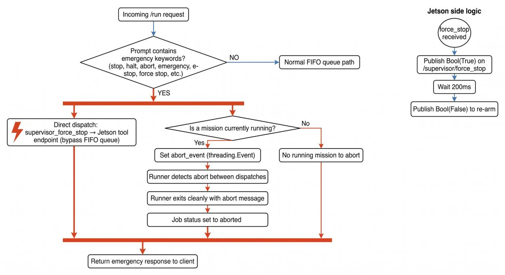

*Docker container layer stack on AWS EC2*
</div>

- **Tailscale VPN** in kernel TUN mode for reliable SSH tunneling
- **3-attempt retry** with exponential backoff for SSH tunnel establishment
- **`Connection: close`** header on every dispatch to prevent stale SSH connections
- **4-attempt retry** with exponential backoff for OmniLink 504 errors
- **Supabase** chat-history upload (non-blocking) for post-mission review
- Latency dominated by physical robot execution (30-120s per tool call), not network overhead

---

### 8. Web Application

The Flutter/Supabase web application serves as the primary human-machine interface:

- Natural language chat interface (Arabic + English)
- Real-time mission status and robot telemetry
- Scheduled task automation — set a time, and ANUBIX runs autonomously
- Field health heatmaps and scan result history
- Photo gallery from each inspection mission

<div align="center">
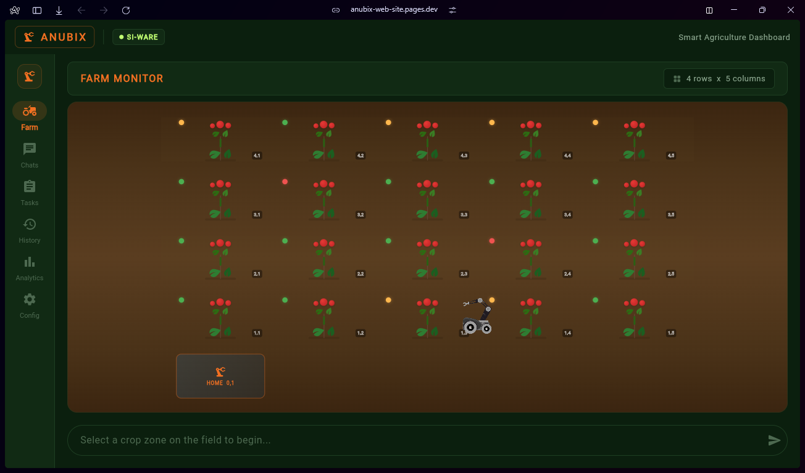

*The Flutter web dashboard — Farm Monitor view with interactive crop zone grid, real-time robot position, and natural language command input*
</div>

---

## ROS 2 Topic Map

<details>
<summary><strong>Click to expand full topic list</strong></summary>

#### Supervisor Command Topics (Master -> Subsystems)

| Topic | Type | QoS | Description |
|---|---|---|---|
| `/supervisor/robot_id` | `String` | TRANSIENT_LOCAL | Mission context: robot identifier |
| `/supervisor/task_id` | `String` | TRANSIENT_LOCAL | Mission context: task identifier |
| `/supervisor/nav_vision` | `Bool` | TRANSIENT_LOCAL | `true` = stop 1m short for camera scan |
| `/supervisor/nav_goal` | `PoseStamped` | TRANSIENT_LOCAL | Navigation waypoint with phase tag |
| `/supervisor/target_camera` | `String` | TRANSIENT_LOCAL | `"1"` = RealSense, `"2"` = USB flange |
| `/supervisor/perception_goal` | `String` | VOLATILE | Triggers detection pipeline (avoids DDS dedup) |
| `/supervisor/arm_nav_goal` | `PoseStamped` | TRANSIENT_LOCAL | Arm target pose with phase tag |
| `/supervisor/grip` | `Bool` | TRANSIENT_LOCAL | `true` = close gripper, `false` = open |
| `/supervisor/spectral_target` | `String` | VOLATILE | Triggers spectrometer scan |
| `/supervisor/force_stop` | `Bool` | VOLATILE | Edge-triggered abort pulse |
| `/supervisor/supabase_upload` | `String` | TRANSIENT_LOCAL | Triggers cloud upload |

#### Feedback Topics (Subsystems -> Master)

| Topic | Type | Description |
|---|---|---|
| `/nav/status` | `String` | `point_reached`, `navigation_failed`, `blocked` |
| `/perception/status` | `String` | `found`, `not_found` |
| `/perception/target_pose` | `Pose` | 3D offset of detected leaf |
| `/arm/arm_status` | `String` | `success`, `mechanical_error`, `failure` |
| `/arm/current_pose` | `PoseStamped` | Latest absolute arm pose |
| `/gripper/status` | `String` | `gripped`, `released`, `slipped` |
| `/spectrometer/status` | `String` | Scan result with diagnosis label |
| `/supabase/status` | `String` | Upload confirmation |

</details>

---

## Repository Structure

This workspace contains **9 ROS 2 packages**:

```
anubix_ws/
├── src/
│   ├── anubix_master/              # Central brain — AI agent <-> ROS 2 bridge
│   │   ├── anubix_master/
│   │   │   └── ros_master_node.py  # HTTP server + 11 publishers + 8 subscribers
│   │   └── config/
│   │       └── master_params.yaml  # Configurable parameters
│   ├── anubix_navigation/          # SLAM, path planning, waypoint navigation
│   │   └── anubix_navigation/
│   │       └── nav_node.py         # Nav2 goal dispatch with vision standoff
│   ├── anubix_vision/              # YOLOv8 perception, dual-camera pipeline
│   │   └── anubix_vision/
│   │       ├── vision_node.py      # Main vision node (RealSense + flange)
│   │       └── leaf_detection.py   # Pure-function detection helpers
│   ├── anubix_arm/                 # MyCobot Pro 450 kinematics & control
│   │   └── anubix_arm/
│   │       ├── arm_node.py         # DH kinematics, trajectory, safety
│   │       └── mission.py          # Arm test runner
│   ├── anubix_gripper/             # myGripperF100 end-effector control
│   │   └── anubix_gripper/
│   │       └── gripper_node.py     # Position-monitoring grip detection
│   ├── anubix_spectrometer/        # SI-NIR driver, spectral data + ML inference
│   │   └── anubix_spectrometer/
│   │       ├── spectrometer_node.py    # ROS 2 node
│   │       └── spectrometer_driver.py  # TCP driver + cloud ML client
│   ├── anubix_supabase/            # Cloud upload (results, photos, diagnosis)
│   │   └── anubix_supabase/
│   │       └── supabase_node.py    # Supabase Storage + PostgreSQL upload
│   ├── anubix_jetson_bridge/       # Cross-device link monitor (Jetson <-> RPi)
│   │   └── anubix_jetson_bridge/
│   │       └── jetson_bridge_node.py   # Heartbeat + reconnection
│   └── anubix_bringup/             # Launch files for full system startup
│       └── launch/
│           └── jetson.launch.py    # Full orchestration launch
├── agent_config/                   # AI agent prompt & tool definitions
│   └── ANUBIX_AGENT_PROMPT_v3_TOOLCALLS.txt
└── docs/assets/                    # Project images and diagrams
```

---

## Getting Started

### Prerequisites

- **Hardware**: NVIDIA Jetson Orin Nano (8GB), Raspberry Pi 4, MyCobot Pro 450, SI-NIR Spectrometer, Intel RealSense D435i, RPLiDAR A1, ESP32
- **Software**: Ubuntu 22.04 (Jetson + RPi), ROS 2 Humble, Python 3.10+, CycloneDDS

### Dependencies

```bash
# ROS 2 packages
sudo apt install ros-humble-nav2-bringup ros-humble-slam-toolbox \
                 ros-humble-robot-localization ros-humble-realsense2-camera

# Python packages
pip install pymycobot pyrealsense2 ultralytics supabase numpy scipy
```

### Build

```bash
cd anubix_ws
colcon build --symlink-install
source install/setup.bash
```

### Launch

```bash
# Full system launch on the Jetson
ros2 launch anubix_bringup jetson.launch.py

# Individual nodes (for debugging)
ros2 run anubix_vision vision_node
ros2 run anubix_arm arm_node
ros2 run anubix_spectrometer spectrometer_node
```

### Configuration

Key parameters in `src/anubix_master/config/master_params.yaml`:
- `tool_server_port`: HTTP server port for AI agent tool calls (default: 5050)
- `nav_standoff_distance`: Distance to stop short when vision mode is active (default: 1.0m)
- `arm_timeout`: Maximum wait time for arm movements (default: 120s)

---

## The Journey

Building ANUBIX was more than a graduation project — it was a year of growing lab tomatoes in our apartments, transporting plants across Cairo, debugging Jetson boot failures with soldered STM32 serial probes, and collecting thousands of spectral readings one leaf at a time.

<div align="center">

<table>
<tr>
<td align="center">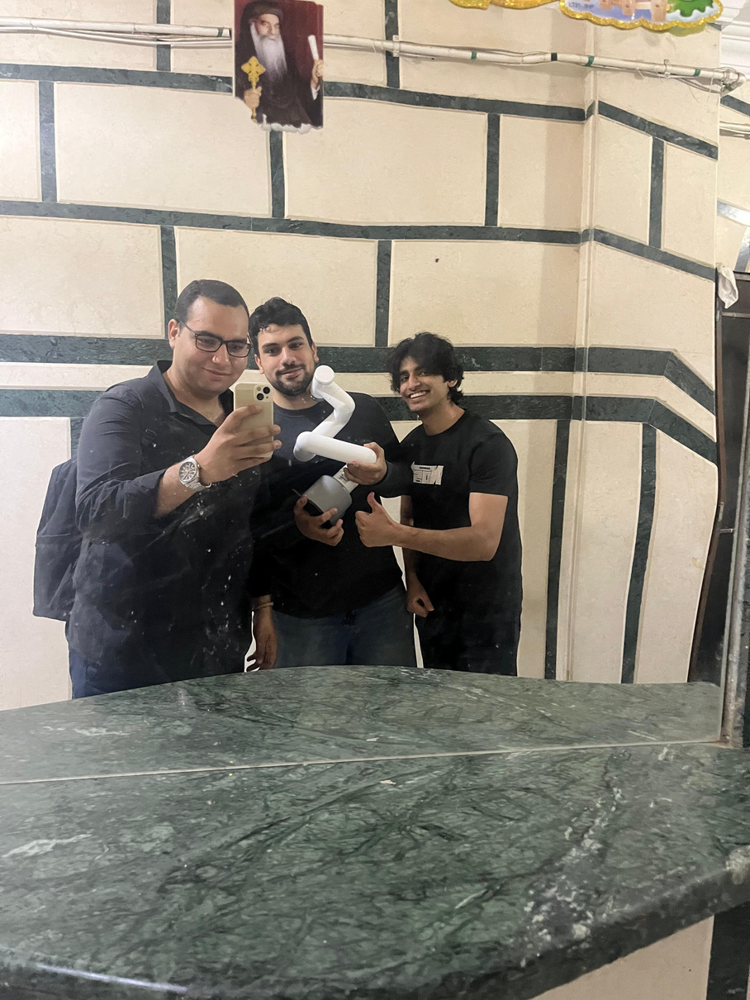<br><em>The day the arm first moved</em></td>
<td align="center">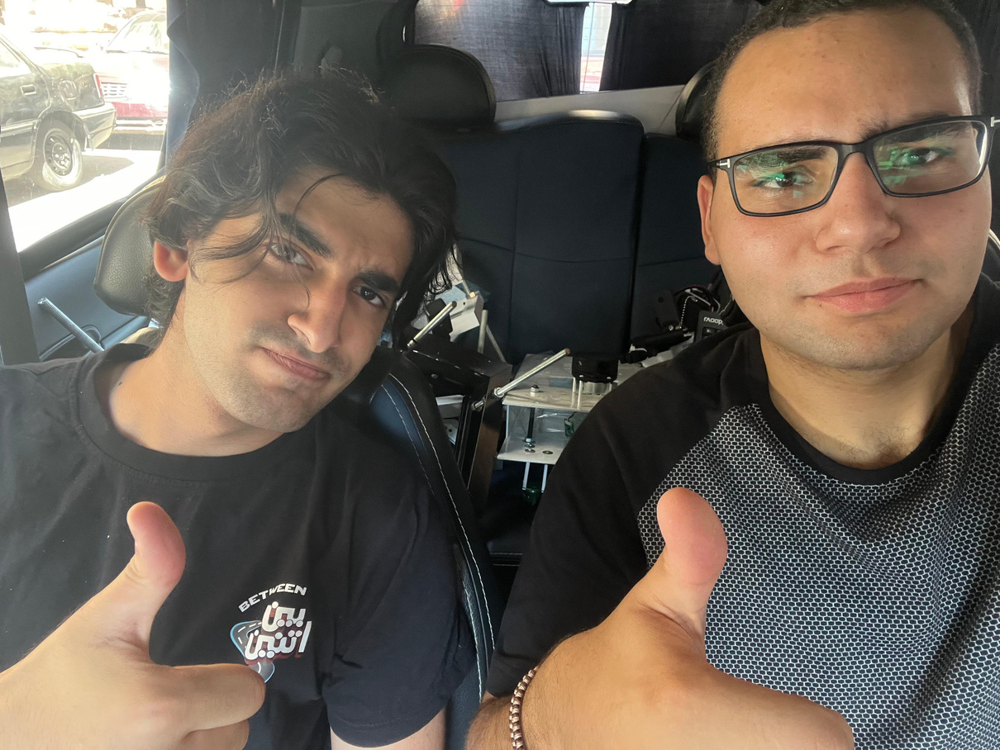<br><em>Transporting ANUBIX for testing</em></td>
</tr>
<tr>
<td align="center">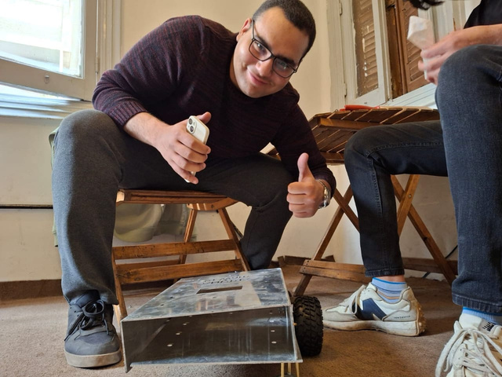<br><em>Building the mobile base from scratch</em></td>
<td align="center">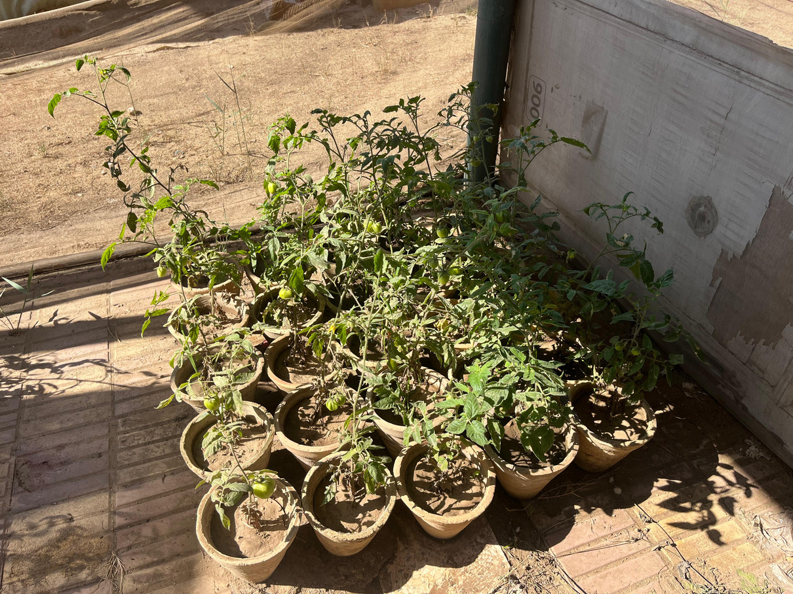<br><em>Our tomato plants — grown for data collection</em></td>
</tr>
<tr>
<td align="center">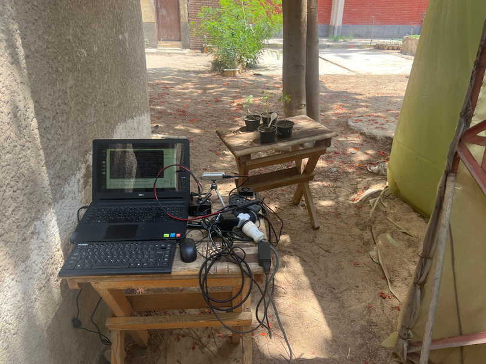<br><em>The spectrometer rig during field collection</em></td>
<td align="center">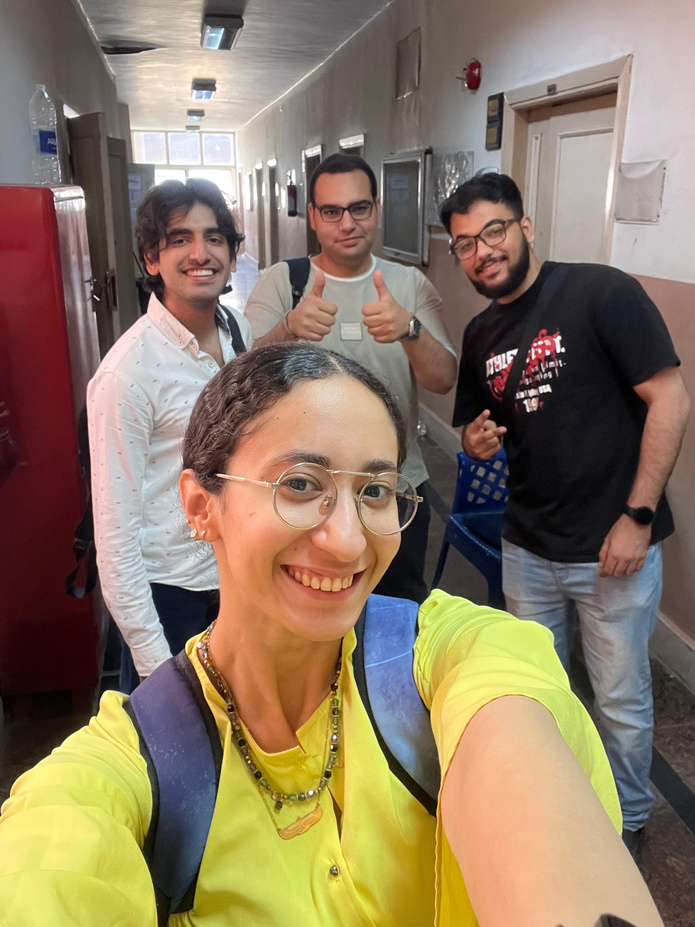<br><em>Late nights building the robot</em></td>
</tr>
</table>

</div>

---

## Acknowledgments

This project would not have been possible without:

- **[Si-Ware Systems](https://www.si-ware.com/)** — Co-owner of the project alongside our university. Provided the Sponsorship, SI-NIR spectrometer, technical mentorship, and lab access. Special thanks to Dr. Yasser Sabry, Dr. Sherif Okda, Eng. Moez El Massry, and Eng. Shady Reda.

- **[OmniLink Agents](https://omnilink.ai)** — Provided the AI agent infrastructure that power ANUBIX's cognitive engine. Thanks to Eng. Ahmed Fetouh.

- **Department of Plant Diseases, Faculty of Agriculture, Ain Shams University** — Dr. Medhat Kamel provided essential agricultural mentorship and the plant samples needed for data collection and field testing.

- **Prof. Dr. Lamiaa Elrefaei** — Our project supervisor, whose guidance shaped every aspect of ANUBIX from architecture to execution.

---

<div align="center">

*Built with determination, tomato plants, and way too much coffee.*

**Benha University — Shoubra Faculty of Engineering — CCEP Department — Class of 2026**

</div>
